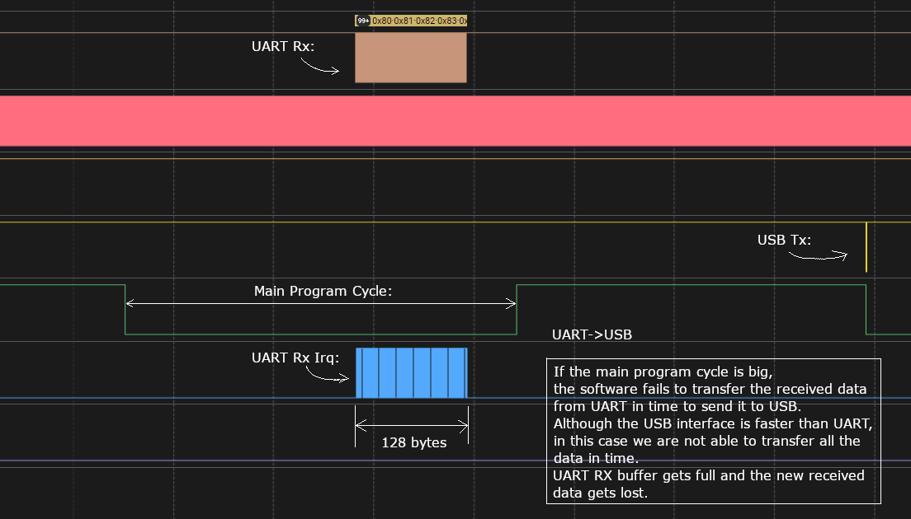

# RPico CDC UART

An implementation of a USB-CDC-UART bridge for Raspberry Pi Pico. The Pico device (which is powered by USB and recognized by the operating system as a CDC device) forwards all received USB data to its UART and data received from the UART back to USB, acting as a USB-UART bridge. 

Main features:
- USB CDC uses the TinyUSB library running on a separate core, leaving the main core for bridge processing.
- UART is fully configurable and based on interrupts (non-blocking mode), maintaining the responsiveness of the main core.
- A separate UART module (also fully configurable and interrupt-based/non-blocking) operating in ASCII mode and used as a logging and/or command line interface (profiling, debugging, etc.)
- Full Software control over data transfer.

## Terms

**Asynchronous Serial Communication** is a form of serial communication in which the communicating endpoints' interfaces are not continuously synchronized by a common clock signal. Instead of a common synchronization signal, the data stream contains synchronization information in form of start and stop signals, before and after each unit of transmission, respectively. The start signal prepares the receiver for arrival of data and the stop signal resets its state to enable triggering of a new sequence.

**UART** (Universal Asynchronous Receiver-Transmitter) is a peripheral device for asynchronous serial communication in which the data format and transmission speeds are configurable. It sends data one by one, from the least significant to the most significant, framed by start and stop bits so that precise timing is handled by the communication channel. The electric signaling levels are handled by a driver circuit external to the UART. Common signal levels are RS-232, RS-485, and raw TTL.

**USB CDC** (USB Communications Device Class) is a composite Universal Serial Bus device class. This class can be used for industrial equipment such as CNC machinery to allow upgrading from older RS-232 serial controllers and robotics, since they can keep software compatibility. The device attaches to an RS-232 communications line and the operating system on the USB side makes the USB device appear as a traditional RS-232 port.

USB CDC **ACM** (Abstract Control Model) is a vendor-independent publicly documented protocol that can be used for emulating serial ports over USB.

## Transfer bottleneck

USB (full speed 12 Mbps) is faster than UART. The bottleneck in USB-UART transmission is always UART. UART cannot send data as fast as USB receives.

### USB -> UART


If we continuously send data USB->UART, we will reach a point where the UART transmit buffer is full and there is no more space to store any more data received via USB (to be sent via UART).

Solutions:
1. Make the UART transmit buffer as big as possible.
2. Implement flow control: continuously monitor how full the UART transmit buffer is and control corresponding flow control signals on the USB side.

### UART -> USB



Theoretically, there shouldn't be any problems with UART->USB data transfer. However, if the main program cycle is long (takes a lot of time) and the UART receive buffer is small, the software may not be able to transfer the received UART data to USB in a timely manner. The UART receive buffer becomes full, and the newly received data is lost.

Solution:
1. Make UART receive buffer bigger.
2. Monitor program main cycle.
3. Implement flow control: continuously monitor how full the UART receive buffer is and control the corresponding flow control signals on the UART side.

## Build

Install Raspberry Pi Pico SDK:
https://www.raspberrypi.com/documentation/microcontrollers/c_sdk.html

Clone code to `~/pico_dev/`.

Export `pico-sdk` path, example:

```bash
export PICO_SDK_PATH=~/pico/pico-sdk
```
    
Create build directory in `~/pico_dev/RPico_CDC_UART/build`:

```bash
cd ~/pico_dev/RPico_CDC_UART
mkdir build
cd build
```

Build project:

```bash
cmake ../src/
make
```

## Deploy

### Prerequisites: picotool

The following steps describe the installation process of Picotool – a tool for interacting with Raspberry Pi Pico devices when they are in BOOTSEL mode (for example: firmware update).

__Getting picotool:__

```bash
cd ~/pico/
git clone https://github.com/raspberrypi/picotool.git --branch master
cd picotool
```

Install required libusb library:

```bash
sudo apt install libusb-1.0-0-dev
```

__Building picotool:__

```bash
mkdir build
cd build
export PICO_SDK_PATH=~/pico/pico-sdk
cmake ../
make
```

__Install picotool:__

```bash
cmake -DCMAKE_INSTALL_PREFIX=~/.local ..
make install
```

### Deploy firmware to Raspberry Pi Pico

If the Raspberry Pi Pico has not yet been updated with `rpico_cdc_uart.uf2` (this is the first time the device is updated with this firmware), manually put the Raspberry Pi Pico into boot mode: unplug from USB, press BOOTSEL, plug in the USB, release BOOTSEL.

If the Raspberry Pi Pico has already been updated with `rpico_cdc_uart.uf2`, the above step is not required. The `scripts/firmware_update.py` script checks if there is "TinyUSB" device connected, and sends a dummy byte at /dev/ttyACM0 uisng 1200 bps as baudrate. This reboots the device into boot mode.

Use `make deploy` command to load the firmware into the Raspberry Pi Pico:

```bash
$ make deploy
[  1%] Built target bs2_default
[  4%] Built target bs2_default_library
[  5%] Performing build step for 'pioasmBuild'
[100%] Built target pioasm
[  5%] Performing install step for 'pioasmBuild'
[100%] Built target pioasm
Install the project...
-- Install configuration: "Release"
[  6%] Completed 'pioasmBuild'
[ 11%] Built target pioasmBuild
[ 12%] Built target rpico_cdc_uart_puart_tx_pio_h
[ 98%] Built target rpico_cdc_uart
[100%] Deploying the firmware to pico
Deploying to pico...
TinyUSB Device found. Try to jump to Boot.
Bus 001 Device 012: ID 2e8a:0003 Raspberry Pi RP2 Boot
Raspberry Pi RP2 Boot found.
Update device with firmware: rpico_cdc_uart.uf2
Loading into Flash:   [==============================]  100%
Success, reboot device.
The device was rebooted into application mode.
[100%] Built target deploy
```

## Test

Use python script `test/test.py` to test the data transfer in both directions (USB <-> UART):


```bash
python3 test.py -h
usage: test.py [-h] [-a UART_DEVICE] [-u USB_DEVICE] [-b BAUDRATE] [-f FROM_VALUE] [-t TO_VALUE] send_device

Test RPico_CDC_UART firmware.

positional arguments:
  send_device           Device that sends data (UART or USB

options:
  -h, --help            show this help message and exit
  -a UART_DEVICE, --uart UART_DEVICE
                        UART device (default: /dev/ttyUSB0)
  -u USB_DEVICE, --usb USB_DEVICE
                        USB device (default: /dev/ttyACM0)
  -b BAUDRATE, --baudrate BAUDRATE
                        Baudrate (default: 115200)
  -f FROM_VALUE, --from FROM_VALUE
                        Test range from (default: 1)
  -t TO_VALUE, --to TO_VALUE
                        Test range to (default: 2050)

```

Example test: USB->UART, 1000 bytes (from 1 to 1000), baudrate 115200 bps:

```
python3 test.py --to 1000 -b 115200 USB
```

Example test: UART->USB, 200 bytes (from 100 to 300), baudrate 9600 bps:

```
python3 test.py --from 100 --to 300 -b 9600 UART
```

Info:
- PICO an USB attached is in linux as "/dev/ttyACMx" detected.
- FTDI RS232-USB adapter is in linux as "/dev/ttyUSBx" detected.

## Known Issues

**1. Time to configure UART**
When opening the USB CDC port, the device needs some time (~5 ms) to apply the same settings (baud rate and line coding) to the UART interface. If the data is sent immediately (without delay) after opening the USB CDC port, the first byte may be lost. To work around this, there is a delay in the tests after the ports are opened:

```
...
ser_tx = serial.Serial(DEVICE_NAME_TX, BAUDRATE)
ser_rx = serial.Serial(DEVICE_NAME_RX, BAUDRATE, timeout=0)

# Give time (~10ms) to pico to configure the UART interface
time.sleep(0.01)
...
```

**2. UART TX Interrupt not called for the first byte to send**

According to RP2040 Datasheet, 4.2 UART -> 4.2.6 Interrupts -> 4.2.6.3. UARTTXINTR:

> _The transmit interrupt is based on a transition through a level, rather than on the level itself. When the interrupt and the UART is enabled before any data is written to the transmit FIFO the interrupt is not set. The interrupt is only set, after written data leaves the single location of the transmit FIFO and it becomes empty._

The Tx interrupt is generated after a byte is sent. We can't send the first byte directly from the interrupt—the interrupt isn't called. To work around this, the UART driver sends a dummy byte (0) after initialization to enable the TX interrupt.

## Notes

__Implement TX_ACTIVE Signal__

Set a GPIO as Output and set it (to active High or Low) while transmitting data.
This allows using UART together with RS-485 transceivers (for example with THVD1429).

Set the TX_ACTIVE before writing the first data to the shift register and reset it after UART has finishing sending the last data (together with the stop-bit).

How to detect when UART has finished sending the stop-bit of the last data:

- In case of the UART: check UARTFR (Flag Register) bit BUSY (3).
- In case of PIO-UART: check SMx_EXECCTRL (Execution/behavioural settings for state machine x) bit EXEC_STALLED (31). EXEC_STALLED (RO) - If 1, an instruction written to SMx_INSTR is stalled, and latched by the state machine. Will clear to 0 once this instruction completes.

## TODO

- Try to fix Known-Issue #2 without sending the dummy byte at init.
- When UART settings changed, reinit all intern variables including ring buffers and pointers.
- Add more tests: random directions (usb/uart), random data length packets.
- Implement flow control: Continuously monitor the fullness of the receive/send buffer.
- Check if we can use FIFO or DMA.
- Get rid of pico UART libraries and implement as much as possible in driver.
