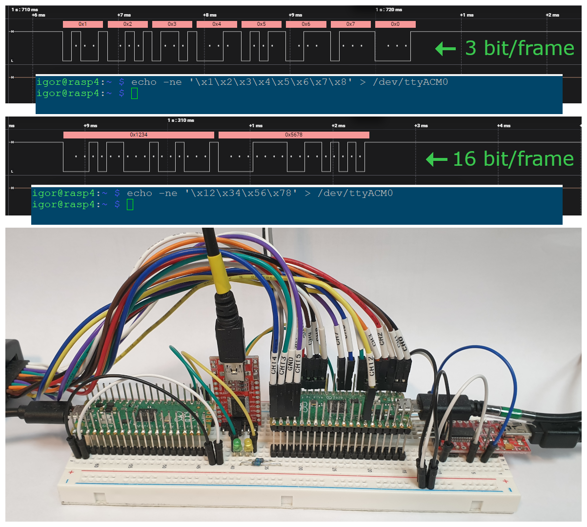
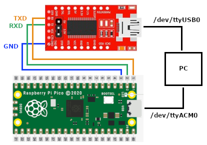
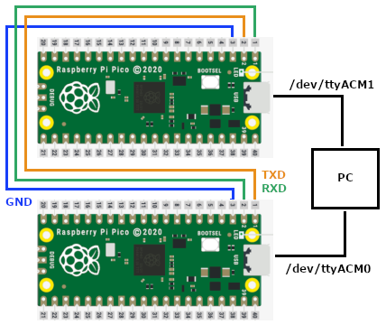

# RPico CDC UART



An implementation of a USB-UART bridge for Raspberry Pi Pico (RPico). The Pico device (which is powered by USB and recognized by the operating system as a CDC device) forwards all received USB data to its UART and data received from the UART back to USB, acting as a USB-UART bridge. 

Main features:
- PIO-UART - a fully configurable UART implemented using RP2040 PIO; supports a wide range of standard and non-standard baud-rates (from 238 bits/sec up to 3,1 Mbits/sec); supports a wide range of standard and non-standard frame formats (from 3 to 16 bits/frame); interrupt-based (non-blocking mode) - maintaining the responsiveness of the main core.
- Peripheral-UART - a fully configurable UART implemented using RP2040 UART peripheral; supports only standard baud-rates; supports only standard frame formats (from 5 to 8 bits/frame); interrupt-based (non-blocking mode) - maintaining the responsiveness of the main core.
- USB CDC uses the TinyUSB library running on a separate core, leaving the main core for UART-USB bridge processing.
- A separate UART module (also fully configurable and interrupt-based, implemented using RP2040 UART peripheral) operating in ASCII mode and used as a logging and/or command line interface (profiling, debugging, etc.)
- Full Software control over data transfer.
- A set of GPIO which can be used for different purposes:  trigger when some conditions are satisfied (ex: a special frame is received) or send some telegrams when an input level is detected.

## Terms

**Asynchronous Serial Communication** is a form of serial communication in which the communicating endpoints' interfaces are not continuously synchronized by a common clock signal. Instead of a common synchronization signal, the data stream contains synchronization information in form of start and stop signals, before and after each unit of transmission, respectively. The start signal prepares the receiver for arrival of data and the stop signal resets its state to enable triggering of a new sequence.

**UART** (Universal Asynchronous Receiver-Transmitter) is a peripheral device for asynchronous serial communication in which the data format and transmission speeds are configurable. It sends data one by one, from the least significant to the most significant, framed by start and stop bits so that precise timing is handled by the communication channel. The electric signaling levels are handled by a driver circuit external to the UART. Common signal levels are RS-232, RS-485, and raw TTL.

**USB CDC** (USB Communications Device Class) is a composite Universal Serial Bus device class. This class can be used for industrial equipment such as CNC machinery to allow upgrading from older RS-232 serial controllers and robotics, since they can keep software compatibility. The device attaches to an RS-232 communications line and the operating system on the USB side makes the USB device appear as a traditional RS-232 port.

USB CDC **ACM** (Abstract Control Model) is a vendor-independent publicly documented protocol that can be used for emulating serial ports over USB.

**RPico** an abbreviation for "Raspberry Pi Pico".

**RP2040** is a 32-bit dual-core ARM Cortex-M0+ microcontroller used in Raspberry Pi Pico board.

**PIO** (Programmable I/O) is a piece of hardware developed for RP2040. It allows to create new types of (or additional) hardware interfaces on RP2040-based device. The PIO subsystem on RP2040 allows to write small, simple programs for what are called PIO state machines, of which RP2040 has eight split across two PIO instances. A state machine is responsible for setting and reading one or more GPIOs, buffering data to or from the processor (or RP2040’s ultra-fast DMA subsystem), and notifying the processor, via IRQ or polling, when data or attention is needed.

**PIO-UART** is the UART interface implemented on RP2040 using PIO.

## Configuration

The USB-UART bridge can be configured by editing the CMakeLists file (`src\CMakeLists.txt`). 

The following options are possible:

__USE_PIO_UART__

The UART interface in the USB-UART bridge can work in one of two modes:
- PIO-UART - UART is implemented in PIO. A wide range of non-standard baud-rates and frame-formats are supported. The UART settings are hardcoded in Firmware and cannot be changed on run-time.
- Peripheral-UART - the RP2040 UART peripheral is used. Only the standard baud-rates and frame-formats are supported. The UART settings can be changed on run-time (when connecting to USB).

When `USE_PIO_UART` is defined, the UART works in PIO-UART mode, when `USE_PIO_UART` is not defined, the UART works in Peripheral-UART mode.

```
add_compile_definitions(USE_PIO_UART)
```

__PIO-UART Settings__

When UART works in PIO-UART mode (`USE_PIO_UART` is defined), the settings of the PIO-UART are set using the following:

```
set(use_uart_baudrate 9600)
set(use_uart_data_bit 3)
set(use_uart_data_hblb 1)
set(use_pio_clkdiv 0)
```

- `use_uart_baudrate` - specifies the baud-rate to be used by the PIO-UART.
- `use_uart_data_bit` - specifies the frame format (bits/frame) to be used by the PIO-UART. (Currently supported: 3..16 bits/frame)
- `use_uart_data_hblb` - when frame format is bigger than 8 bit/frame, every frame is sent to USB as two bytes. If `use_uart_data_hblb` is set to 1, the bytes are sent in the High-Byte/Low-Byte order.
- `use_pio_clkdiv` - when `use_pio_clkdiv` is not 0, `use_uart_baudrate` is ignored and the baud-rate is calculated using formula: `use_uart_baudrate = 125MHz/(use_pio_clkdiv * 8)`

__TX_ACTIVE_SIGNAL__

This signal allows using UART together with RS-485 transceiver - to switch the transceiver between receive and transmit modes.

```
add_compile_definitions(TX_ACTIVE_SIGNAL=28)
add_compile_definitions(TX_ACTIVE_SIGNAL_INVERTED)
```

- `TX_ACTIVE_SIGNAL` - specifies the GPIO pin to be used as TX_ACTIVE signal: is set active while UART sends data.
- `TX_ACTIVE_SIGNAL_INVERTED` - when defined, the TX_ACTIVE signal is inverted (low active).

__RX/TX Activity LEDs__

Two outputs can be used to visually indicate a receive or transmit activity (ex. by connecting a LED):

```
add_compile_definitions(UART_RX_ACT_LED=16)
add_compile_definitions(UART_TX_ACT_LED=17)
```

- `UART_RX_ACT_LED` - specifies the GPIO pin to toggle in case the UART is currently receiving data.
- `UART_TX_ACT_LED` - specifies the GPIO pin to toggle in case the UART is currently transmiting data.

__UART_RX_BYTES_TOUT__

The following setting doesn't allow USB to send small packets for each received UART byte. Instead send UART->USB when no further data is received from UART for more than `UART_RX_BYTES_TOUT` bytes time (depending on baud-rate) or when more than 64 bytes have been received.

```
add_compile_definitions(UART_RX_BYTES_TOUT=2)
```

## Build

Install Raspberry Pi Pico SDK:
https://www.raspberrypi.com/documentation/microcontrollers/c_sdk.html

Clone code to `~/pico_dev/`.

Export `pico-sdk` path, example:

```bash
export PICO_SDK_PATH=~/pico/pico-sdk
```
    
Create build directory in `~/pico_dev/RPico_CDC_UART/build`:

```bash
cd ~/pico_dev/RPico_CDC_UART
mkdir build
cd build
```

Build project:

```bash
cmake ../src/
make
```

## Deploy

### Prerequisites: picotool

The following steps describe the installation process of Picotool – a tool for interacting with RPico devices when they are in BOOTSEL mode (for example: firmware update).

__Getting picotool:__

```bash
cd ~/pico/
git clone https://github.com/raspberrypi/picotool.git --branch master
cd picotool
```

Install required libusb library:

```bash
sudo apt install libusb-1.0-0-dev
```

__Building picotool:__

```bash
mkdir build
cd build
export PICO_SDK_PATH=~/pico/pico-sdk
cmake ../
make
```

__Install picotool:__

To install `picotool` only for the current user (in `/home/$USER/.local/bin/picotool`):

```bash
cmake -DCMAKE_INSTALL_PREFIX=~/.local ..
make install
```

To install `picotool` for all users (in `/usr/bin/picotool`):

```bash
cmake -DCMAKE_INSTALL_PREFIX=/usr ..
sudo make install
```

### Prerequisites: usbtool

`firmware_update.sh` script uses the `lsusb` command to identify the RPico connected to the USB Port. If `lsusb` is not available, install it using the following command:

```bash
sudo apt-get install usbutils
```

### Deploy firmware to RPico

If the RPico has not yet been updated with `rpico_cdc_uart.uf2` (this is the first time the device is updated with this firmware), manually put the RPico into boot mode (unplug from USB, press BOOTSEL, plug in the USB, release BOOTSEL) and copy the firmware to the mounted partition.

If the RPico has already been updated with `rpico_cdc_uart.uf2`, the above step is not required. The `scripts/firmware_update.py` script checks if there is "TinyUSB" device connected, and sends a dummy byte at `/dev/ttyACM0` uisng 1200 bps as baud-rate. This reboots the device into boot mode.

Use `sudo make deploy` command to load the firmware into the RPico (which updates the `/dev/ttyACM0` device):

```bash
$ sudo make deploy
[  1%] Built target bs2_default
[  4%] Built target bs2_default_library
[  5%] Built target rpico_cdc_uart_puart_tx_pio_h
[  6%] Built target rpico_cdc_uart_puart_rx_pio_h
[ 98%] Built target rpico_cdc_uart
[100%] Deploying the firmware to pico
Deploying to pico...
TinyUSB Device found, assuming this is /dev/ttyACM0. Try to jump to Boot.
Bus 001 Device 107: ID 2e8a:0003 Raspberry Pi RP2 Boot
Raspberry Pi RP2 Boot found.
Update device with firmware: rpico_cdc_uart.uf2
Loading into Flash:   [==============================]  100%
Success, reboot device.
[100%] Built target deploy
```

If two RPico devices must be updated at the same time (for example while executing PIO-UART tests) the `sudo make deployall` command ca be used (which loads the firmware into `/dev/ttyACM0` and `/dev/ttyACM1` devices).

## Test

### Prerequisites 

Python `pyserial` library is required to run the tests:

```bash
sudo apt-get install python3-serial
```

### Test Setups

Depending which UART mode is tested (Peripherl-UART or PIO-UART) one of the following two test-setups is used:

__Peripheral-UART mode: RPico + USB Serial Adapter__



When testing Peripheral-UART mode, a standard USB Serial Adapter TTL can be used (for example FT232 module). The RXD signal from RPico is connected to the TXD signal of the USB Serial Adapter, and the TXD signal from RPico is connected to the RXD signal of the USB Serial Adapter. Both devices are connected to USB ports to a PC. The RPico is detected as `/dev/ttyACMx` and the USB Serial Adapter as `/dev/ttyUSBx`.

__PIO-UART mode: 2 x RPico__



When testing PIO-UART mode, two RPico could be used (the standard USB Serial Adapter TTL do not recognize the non-standard frame formats and baudrates and therefore cannot be used). The RXD signal from one RPico is connected to the TXD signal of the second RPico and vice versa. Both devices are connected to USB ports to a PC. Both RPico are detected as `/dev/ttyACMx`.

### Test using sertest.py

`sertest.py` script executes a data transfer test from one device to the second device. The script sends data packets of a specific length and containing a specific data template to one device, meanwhile recieves all incoming data from the second device. If the data received from the second device matches the data sent to the first device - the test passed, if not - the test failed. 

The scripts allows to automatically execute multiple tests with different data packet lengts. In this case, a starting packet length and an ending packet length are specified - the script performs a series of tests with different packet lengths within this range.

The scripts allows to automatically change the direction of the data transfer for every data packet: direct - from first device to second device, reverse - from second device to first device, repeatedly - first device to second device and vice versa repeatedly, random - randomly from one deivce to other device.

In case of testing Peripheral-UART mode, the script automatically configures the RPico with required UART settings.

In case of testing PIO-UART mode, the script cannot configure the RPico UART settings (the UART settings are hardcoded). In this case, before executing the test, a correct configuration must be set in `CMakeLists.txt` and the resulting Firmware uploaded into RPico.

The script accepts the following arguments:

```bash
$ python3 sertest.py
usage: sertest.py [-h] [-b BAUDRATE] [-c BIT_CNT] [-f FROM_VALUE] [-t TO_VALUE] [-n NO_CHECK] [-m TEST_MODE] dev1 dev2
```

Where:

- `-b BAUDRATE` specifies the baud-rate to be used (example: 115200 for 115200 bits/sec).
- `-c BIT_CNT` frame-format to be used (example: 3 for 3 bits/frame).
- `-f FROM_VALUE` and `-t TO_VALUE` starting packet length and an ending packet length.
- `-n NO_CHECK` do not test if the received data matches the sent data.
- `-m TEST_MODE` data template and test-mode used in the test, supports following values:
    - 0 - data packets sent from `dev1` to `dev2`, every new test increments the data packet length
    - 1 - data packets sent from `dev2` to `dev1`, every new test increments the data packet length
    - 2 - data packets sent repeatedly `dev1`->`dev2`, `dev2`->`dev1`, every new test increments the data packet length
    - 3 - data packets sent randomly `dev1`->`dev2` or `dev2`->`dev1`, every new test increments the data packet length
    - 4 - data packets sent from `dev1` to `dev2`, data packets have a random length
    - 5 - data packets sent from `dev2` to `dev1`, data packets have a random length
    - 6 - data packets sent randomly `dev1`->`dev2` or `dev2`->`dev1`, data packets have a random length
- `dev1` first device (`/dev/ttyACMx` for RPico or `/dev/ttyUSBx` for USB Serial Adapter)
- `dev2` second device (`/dev/ttyACMx` for RPico or `/dev/ttyUSBx` for USB Serial Adapter)

Example testing PIO-UART, 9600 bits/sec, 11 bits/frame, data packet length from 1 to 100 bytes, test mode 2:

```
 $ python3 sertest.py -b 9600 -c 11 -f 1 -t 100 -m 2 /dev/ttyACM0 /dev/ttyACM1
+---------------+---------------+-----------+--------+---------+------------+------+------+----------+-----------+
| Device1       | Device2       | Baud-Rate | CLKDIV | Bit-Cnt | Big-Endian | From | To   | No-Check | Test-Mode |
| /dev/ttyACM0  | /dev/ttyACM1  | 9600      | 0      | 11      | 1          | 1    | 100  | 0        | 2         |
+---------------+---------------+-----------+--------+---------+------------+------+------+----------+-----------+
End of test, Result: True ( 100 )##############]   100 /dev/ttyACM0->/dev/ttyACM1 (pack.size: 100)
```

### Test using test_master.py

==TODO==

## Known Issues

**1. Time to configure UART**
When opening the USB CDC port, the device needs some time (~5 ms) to apply the same settings (baud rate and line coding) to the UART interface. If the data is sent immediately (without delay) after opening the USB CDC port, the first byte may be lost. To work around this, there is a delay in the tests after the ports are opened:

```
...
ser_tx = serial.Serial(DEVICE_NAME_TX, BAUDRATE)
ser_rx = serial.Serial(DEVICE_NAME_RX, BAUDRATE, timeout=0)

# Give time (~10ms) to pico to configure the UART interface
time.sleep(0.01)
...
```

**2. UART TX Interrupt not called for the first byte to send**

According to RP2040 Datasheet, 4.2 UART -> 4.2.6 Interrupts -> 4.2.6.3. UARTTXINTR:

> _The transmit interrupt is based on a transition through a level, rather than on the level itself. When the interrupt and the UART is enabled before any data is written to the transmit FIFO the interrupt is not set. The interrupt is only set, after written data leaves the single location of the transmit FIFO and it becomes empty._

The Tx interrupt is generated after a byte is sent. We can't send the first byte directly from the interrupt—the interrupt isn't called. To work around this, the UART driver sends a dummy byte (0) after initialization to enable the TX interrupt.

**3. Detect when COM-Port opened**

The software has to detect when the COM-Port is opened, and collect UART RX data (to be sent over USB) only when COM-Port is opened. There is no need to collect UART RX data if the COM-Port is closed - it leads to data inconsistency.

__Linux__

On Linux, when COM-Port is opened, for example using `open("/dev/ttyACM0", …)`,  the terminal driver asserts DTR by default. The detection could be done by analyzing `dtr` argument in `tud_cdc_line_state_cb()` callback. When `dtr=true`, Linux opened the COM-Port. When `dtr=false`, Linux closed the COM-Port. 

__Windows__

On Windows, the COM port driver does not automatically assert DTR when COM-Port is opened in applications. The application must explicitly request it (e.g. via SetCommState() or EscapeCommFunction(..., SETDTR)). The solution with DTR does not work.

## Notes

### PIO Frequency Limits

System Clock Frequency: `clk_sys = 125MHz`

PIO Frequency: `clk_pio = clk_sys / (CLKDIV_INT + CLKDIV_FRAC/256)`

Maximal PIO Frequency: `clk_pio_max = clk_sys / (1 + 0/256) = 125MHz`

Minimal PIO Frequency: `clk_pio_min = clk_sys / (65536 + 0/256) = 1907,349Hz` 

One bit is sent/received in 8 PIO clocks.

Maximal PIO-UART Baudrate: `pio_max_baud = clk_pio_max / 8 = 15,635MHz`

Minimal PIO-UART Baudrate: `pio_min_baud = clk_pio_min / 8 = 238,42Hz` 

### Measured Bit-Length

All tests executed in 9 bit frame format.

| Baudrate | Measured Bit (Baudr) | CLKDIV_INT | CLKDIV_FRAC |  PIO Freq.  | element_req_ustime |
| -------- | -------------------- | ---------- | ----------- | ----------- | ------------------ |
| 238      | 4,20ms  (238)        | 65535      | 0           |     1907,37 | 50420us            |
| 9600     | 104us   (9615)       | 1627       | 155         |    76799,93 | 1250us             |
| 14400    | 69,4us  (14409)      | 1085       | 18          |   115199,90 | 833us              |
| 19200    | 52,1us  (19193)      | 813        | 205         |   153600,24 | 625us              |
| 38400    | 26us    (38461)      | 406        | 231         |   307199,01 | 312us              |
| 57600    | 17,36us (57603)      | 271        | 68          |   460802,94 | 208us              |
| 115200   | 8,68us  (115207)     | 135        | 162         |   921605,89 | 104us              |
| 230400   | 4.34us  (230302)     | 67         | 209         |  1843211,79 | 52us               |
| 1562500  | 640ns   (1562500)    | 10         | 0           | 12500000,00 | 7us                |
| 3125000* | 320ns   (3125000)    | 5          | 0           | 25000000,00 | 3us                |

3125000 Bits/second is not stable, sometimes the software cannot read on time the received data from PIO and the data is lost. Maybe can be fixed by implementing DMA.

### Transfer Bottleneck

USB (full speed 12 Mbps) is faster than UART. The bottleneck in USB-UART transmission is always UART. UART cannot send data as fast as USB receives.

__USB->UART__


If we continuously send data USB->UART, we will reach a point where the UART transmit buffer is full and there is no more space to store any more data received via USB (to be sent via UART).

Solutions:
1. Make the UART transmit buffer as big as possible.
2. Implement flow control: continuously monitor how full the UART transmit buffer is and control corresponding flow control signals on the USB side.

__UART->USB__


Theoretically, there shouldn't be any problems with UART->USB data transfer. However, if the main program cycle is long (takes a lot of time) and the UART receive buffer is small, the software may not be able to transfer the received UART data to USB in a timely manner. The UART receive buffer becomes full, and the newly received data is lost.

Solution:
1. Make UART receive buffer bigger.
2. Monitor program main cycle.
3. Implement flow control: continuously monitor how full the UART receive buffer is and control the corresponding flow control signals on the UART side.

### UART/USB devices in Linux

`/dev/ttyUSB0` - USB-UART converter, a separate IC (usually FTDI).
`/dev/ttyACM0` - RPico with TinyUSB library that implements CDC ACM (USB Communications Device Class).

### Implement TX_ACTIVE Signal

Set a GPIO as Output and set it (to active High or Low) while transmitting data.
This allows using UART together with RS-485 transceivers (for example with THVD1429).

Set the TX_ACTIVE before writing the first data to the shift register and reset it after UART has finished sending the last data (together with the stop-bit).

How to detect when UART has finished sending the stop-bit of the last data:

- In case of the UART: check UARTFR (Flag Register) bit BUSY (3).
- In case of PIO-UART: check SMx_EXECCTRL (Execution/behavioural settings for state machine x) bit EXEC_STALLED (31). EXEC_STALLED (RO) - If 1, an instruction written to SMx_INSTR is stalled, and latched by the state machine. Will clear to 0 once this instruction completes.

## TODO

- Try to fix Known-Issue #2 without sending the dummy byte at init.
- When UART settings changed, reinit all intern variables including ring buffers and pointers.
- Implement flow control: Continuously monitor the fullness of the receive/send buffer.
- Check if we can use FIFO or DMA.
- Get rid of pico UART libraries and implement as much as possible in driver.
