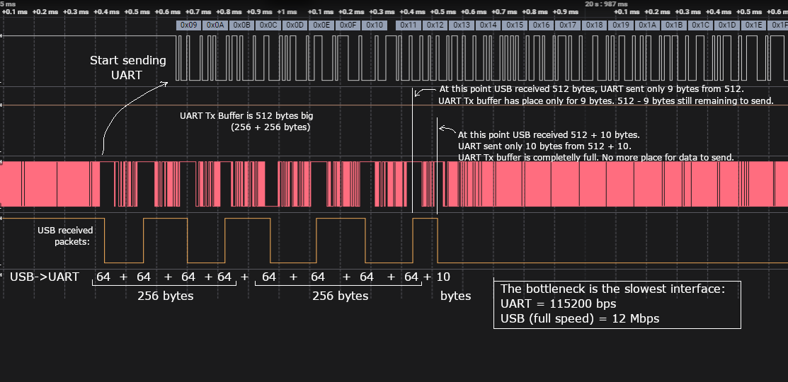

# RPico CDC UART

An implementation of a USB-CDC-UART bridge for Raspberry Pi Pico. The Pico device (which is powered by USB and recognized by the operating system as a CDC device) forwards all received USB data to its UART and data received from the UART back to USB, acting as a USB-UART bridge. 

Main features:
- USB CDC uses the TinyUSB library running on a separate core, leaving the main core for bridge processing.
- UART is fully configurable and based on interrupts (non-blocking mode), maintaining the responsiveness of the main core.
- A separate UART module (also fully configurable and interrupt-based/non-blocking) operating in ASCII mode and used as a logging and/or command line interface (profiling, debugging, etc.)
- Full Software control over data transfer.

## Terms

**Asynchronous Serial Communication** is a form of serial communication in which the communicating endpoints' interfaces are not continuously synchronized by a common clock signal. Instead of a common synchronization signal, the data stream contains synchronization information in form of start and stop signals, before and after each unit of transmission, respectively. The start signal prepares the receiver for arrival of data and the stop signal resets its state to enable triggering of a new sequence.

**UART** (Universal Asynchronous Receiver-Transmitter) is a peripheral device for asynchronous serial communication in which the data format and transmission speeds are configurable. It sends data one by one, from the least significant to the most significant, framed by start and stop bits so that precise timing is handled by the communication channel. The electric signaling levels are handled by a driver circuit external to the UART. Common signal levels are RS-232, RS-485, and raw TTL.

**USB CDC** (USB Communications Device Class) is a composite Universal Serial Bus device class. This class can be used for industrial equipment such as CNC machinery to allow upgrading from older RS-232 serial controllers and robotics, since they can keep software compatibility. The device attaches to an RS-232 communications line and the operating system on the USB side makes the USB device appear as a traditional RS-232 port.

USB CDC **ACM** (Abstract Control Model) is a vendor-independent publicly documented protocol that can be used for emulating serial ports over USB.

## Transfer bottleneck

USB (full speed 12 Mbps) is faster than UART. The bottleneck in USB-UART transmission is always UART. UART cannot send data as fast as USB receives.

### USB -> UART



If we continuously send data USB->UART, we will reach a point where the UART transmit buffer is full and there is no more space to store any more data received via USB (to be sent via UART).

Solutions:
1. Make the UART transmit buffer as big as possible.
2. Implement flow control: continuously monitor how full the UART transmit buffer is and control corresponding flow control signals on the USB side.

### UART -> USB


Theoretically, there shouldn't be any problems with UART->USB data transfer. However, if the main program cycle is long (takes a lot of time) and the UART receive buffer is small, the software may not be able to transfer the received UART data to USB in a timely manner. The UART receive buffer becomes full, and the newly received data is lost.

Solution:
1. Make UART receive buffer bigger.
2. Monitor program main cycle.
3. Implement flow control: continuously monitor how full the UART receive buffer is and control the corresponding flow control signals on the UART side.

## Build

Install Raspberry Pi Pico SDK:
https://www.raspberrypi.com/documentation/microcontrollers/c_sdk.html

Clone code to `~/pico_dev/`.

Export `pico-sdk` path, example when `pico-sdk` located at `/home/igor/pico/pico-sdk`:

```bash
export PICO_SDK_PATH=/home/igor/pico/pico-sdk
```
    
Create build directory in `~/pico_dev/RPico_CDC_UART/build`:

```bash
cd ~/pico_dev/RPico_CDC_UART
mkdir build
cd build
```

Build project:

```bash
cmake ../src/
make
```

## Test

Use python script `test/test.py` to test the data transfer in both directions (USB -> UART):

```
python3 test.py <usb/uart> <test_range_from> <test_range_to> <baudrate>
```

Example test: USB->UART, 1000 bytes (from 1 to 1000), baudrate 115200 bps:

```
python3 test.py usb 1 1000 115200
```

Example test: UART->USB, 200 bytes (from 100 to 300), baudrate 9600 bps:

```
python3 test.py uart 100 300 9600
```

Info:
- PICO an USB attached is in linux as "/dev/ttyACMx" detected.
- FTDI RS232-USB adapter is in linux as "/dev/ttyUSBx" detected.

## TODO

- Bug: After reset or line coding change - the first byte is lost. Why is the first byte not sent?
- Modify python testscripts to use argparse.
- Jump in bootloader without UART-Ascii, use a specific baudrate to jump to bootloader.
- Modify deploy cmake target to invoke a script and to jump to bootloader without UART-Ascii.
- Implement flow control. Continuously monitor the fullness of the receive/send buffer.